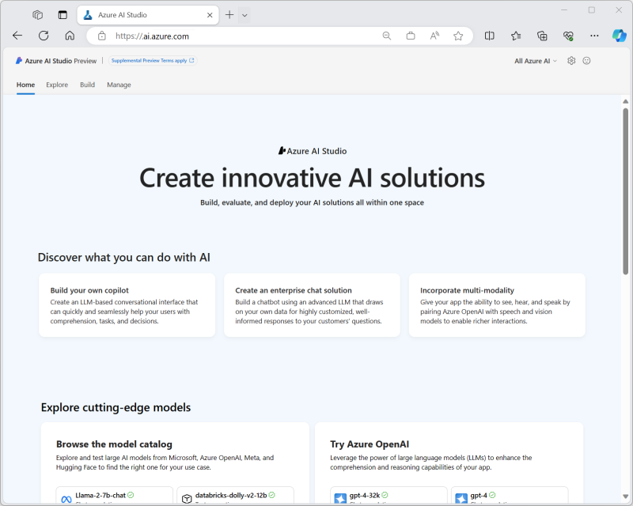

# Overview of Azure OpenAI

Azure OpenAI is a collaboration between Microsoft Azure and OpenAI, a leading research organization in artificial intelligence. It is a cloud-based platform that enables developers and data scientists to build and deploy AI models quickly and easily. With Azure OpenAI, users can access a wide range of AI tools and technologies to create intelligent applications, including natural language processing, computer vision, and deep learning.

Azure OpenAI is designed to accelerate the development of AI applications, allowing users to focus on creating innovative solutions that deliver value to their organizations and customers.

Here are ways that Azure OpenAI can help developers:

- **Simplified integration** - Simple and easy-to-use APIs for tasks such as text generation, summarization, sentiment analysis, language translation, and more.
- **Pre-trained models** - AI models that are already fine-tuned on vast amounts of data making it easier for developers to leverage the power of AI without having to train their own models from scratch.
- **Customization** - Developers can also fine-tune the included pre-trained models with their own data with minimal coding, providing an opportunity to create more personalized and specialized AI applications.
- **Documentation and resources** - Azure OpenAI provides comprehensive documentation and resources to help developers get started quickly.
- **Scalability and reliability** - Hosted on Microsoft Azure, the OpenAI service provides robust scalability and reliability that developers can leverage to deploy their applications.
- **Responsible AI** - Azure OpenAI promotes responsible AI by adhering to ethical principles, providing explainability tools, governance features, diversity and inclusion support, and collaboration opportunities. These measures help ensure that AI models are unbiased, explainable, trustworthy, and used in a responsible and compliance manner.
- **Community support** - With an active developer community developers can seek help via forums and other community support channels.

## Comparison of Azure OpenAI and OpenAI

Azure OpenAI Service gives customers advanced language AI with OpenAI GPT-4, GPT-3, Codex, DALL-E, and Whisper models with the security and enterprise promise of Azure. Azure OpenAI co-develops the APIs with OpenAI, ensuring compatibility and a smooth transition from one to the other.

With Azure OpenAI, customers get the security capabilities of Microsoft Azure while running the same models as OpenAI. Azure OpenAI offers private networking, regional availability, and responsible AI content filtering.

## Azure OpenAI Data Privacy and Security

Azure OpenAI stores and processes data to provide the service and to monitor for uses that violate the applicable product terms. Azure OpenAI is fully controlled by Microsoft. Microsoft hosts the OpenAI models in Microsoft Azure for your usage of Azure OpenAI, and does not interact with any services operated by OpenAI.

Here are a few important things to know in regards to the security and privacy of your prompts (inputs) and completions (outputs), your embeddings, and your training data when using Azure OpenAI:

- are NOT available to other customers.
- are NOT available to OpenAI.
- are NOT used to improve OpenAI models.
- are NOT used to improve any Microsoft or 3rd party products or services.
- are NOT used for automatically improving Azure OpenAI models for your use in your resource (The models are stateless, unless you explicitly fine-tune models with your training data).
- Your fine-tuned Azure OpenAI models are available exclusively for your use.

## Azure AI Platform

Azure AI services help developers and organizations rapidly create intelligent, cutting-edge, market-ready, and responsible applications with out-of-the-box and pre-built and customizable APIs and models.

While this guide focuses on integrating Azure OpenAI, the Azure AI Platform consists of many additional AI services. Each AI service is built to fit a specific AI and/or Machine Learning (ML) need.

Here's a list of the services within the [Azure AI platform](https://learn.microsoft.com/azure/ai-services/what-are-ai-services):

| Service | Description |
| --- | --- |
| Azure AI Search | Bring AI-powered cloud search to your mobile and web apps |
| Azure OpenAI | Perform a wide variety of natural language tasks |
| Bot Service | Create bots and connect them across channels |
| Content Safety | An AI service that detects unwanted contents |
| Custom Vision | Customize image recognition to fit your business |
| Document Intelligence | Turn documents into usable data at a fraction of the time and cost |
| Face | Detect and identify people and emotions in images |
| Immersive Reader | Help users read and comprehend text |
| Language | Build apps with industry-leading natural language understanding capabilities |
| Speech | Speech to text, text to speech, translation and speaker recognition |
| Translator | Translate more than 100 languages and dialects |
| Video Indexer | Extract actionable insights from your videos |
| Vision | Analyze content in images and videos |

> **Note:** Follow this link for additional tips to help in determining the which Azure AI service is most appropriate for a specific project requirement: <https://azure.microsoft.com/products/category/ai>

The tools that you will use to customize and configure models are different from those that you'll use to call the Azure AI services. Out of the box, most Azure AI services allow you to send data and receive insights without any customization.

For example:

- You can send an image to the Azure AI Vision service to detect words and phrases or count the number of people in the frame
- You can send an audio file to the Speech service and get transcriptions and translate the speech to text at the same time

Azure offers a wide range of tools that are designed for different types of users, many of which can be used with Azure AI services. Designer-driven tools are the easiest to use, and are quick to set up and automate, but might have limitations when it comes to customization. The REST APIs and client libraries provide users with more control and flexibility, but require more effort, time, and expertise to build a solution. When using REST APIs and client libraries, there is an expectation that the developer is comfortable working with modern programming languages like C#, Java, Python, JavaScript, or another popular programming language.

## Azure AI Studio

Azure AI Studio is a web portal that brings together multiple Azure AI-related services into a single, unified development environment.

Specifically, Azure AI Studio combines:

- The model catalog and prompt flow development capabilities of Azure Machine Learning service.
- The generative AI model deployment, testing, and custom data integration capabilities of Azure OpenAI service.
- Integration with Azure AI Services for speech, vision, language, document intelligence, and content safety.

Azure AI Studio enables teams to collaborate efficiently and effectively on AI projects, such as developing custom copilot applications that use large language models (LLMs).

Tasks you can accomplish with Azure AI Studio include:

- Deploying models from the model catalog to real-time inferencing endpoints for client applications to consume.
- Deploying and testing generative AI models in an Azure OpenAI service.
- Integrating data from custom data sources to support a retrieval augmented generation (RAG) approach to prompt engineering for generative AI models.
- Using prompt flow to define workflows that integrate models, prompts, and custom processing.
- Integrating content safety filters into a generative AI solution to mitigate potential harms.
- Extending a generative AI solution with multiple AI capabilities using Azure AI services.
