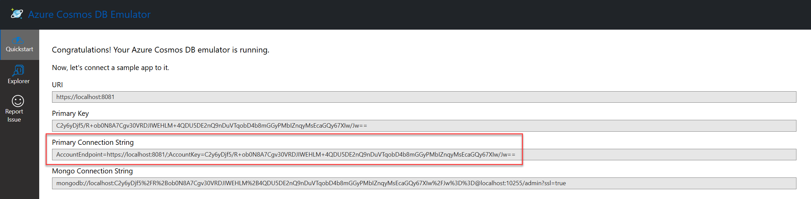
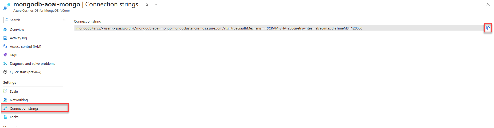

# Create your first Cosmos DB project

This section will cover how to create your first Cosmos DB project. We'll use a notebook to demonstrate the basic CRUD operations. We'll also cover using the Azure Cosmos DB Emulator to test code locally.

## Emulator support

Azure Cosmos DB has an emulator that can be used to develop code locally. The emulator supports the API for NoSQL and the API for MongoDB. The use of the emulator does not require an Azure subscription, nor does it incur any costs, so it is ideal for local development and testing. The Azure Cosmos DB emulator can also be utilized with unit tests in a [GitHub Actions CI workflow](https://learn.microsoft.com/azure/cosmos-db/how-to-develop-emulator?tabs=windows%2Cpython&pivots=api-mongodb#use-the-emulator-in-a-github-actions-ci-workflow).

There is not 100% feature parity between the emulator and the cloud service. Visit the [Azure Cosmos DB emulator](https://learn.microsoft.com/azure/cosmos-db/emulator) documentation for more details.

For Windows machines, the emulator can be installed via an installer. There is a Windows container using Docker available. However, it does not currently support the API for Mongo DB. A Docker image is also available for Linux that does support the API for Mongo DB.

Learn more about the pre-requisites and installation of the emulator [here](https://learn.microsoft.com/azure/cosmos-db/how-to-develop-emulator?tabs=windows%2Cpython&pivots=api-mongodb).

>**NOTE**: When using the Azure CosmosDB emulator using the API for MongoDB it must be started with the [MongoDB endpoint options enabled](https://learn.microsoft.com/azure/cosmos-db/how-to-develop-emulator?tabs=windows%2Cpython&pivots=api-mongodb#start-the-emulator) at the command-line.

**The Azure Cosmos DB emulator does not support vector search. To complete the vector search and AI-related labs, a vCore-based Azure Cosmos DB for MongoDB account in Azure is required.**

## Authentication

Authentication to Azure Cosmos DB API for Mongo DB uses a connection string. The connection string is a URL that contains the authentication information for the Azure Cosmos DB account or local emulator. The username and password used when provisioning the Azure Cosmos DB API for MongoDB service are used in the connection string when authenticating to Azure.

### Retrieving the connection string from the Cosmos DB Emulator

The splash screen or **Quickstart** section of the Cosmos DB Emulator will display the connection string. Access this screen through the following URL: `https://localhost:8081/_explorer/index.html`.



### Retrieving the connection string from the Azure portal

Retrieve the connection string from the Azure portal by navigating to the Azure Cosmos DB account and selecting the **Connection String** menu item on the left-hand side of the screen. The connection string contains tokens for the username and password that must be replaced with the username and password used when provisioning the Azure Cosmos DB API for MongoDB service.



## Lab - Create your first Cosmos DB for the MongoDB application

Using a notebook, we'll create a Cosmos DB for the MongoDB application in this lab using the **pymongo** library and the Python language. Both the Azure Cosmos DB Emulator and Azure Cosmos DB account in Azure are supported for completion of this lab.

>**Note**: It is highly recommended to use a [virtual environment](https://python.land/virtual-environments/virtualenv) for all labs.

Please visit the lab repository to complete [this lab](https://github.com/AzureCosmosDB/Azure-OpenAI-Python-Developer-Guide/blob/main/Labs/lab_1_first_application.ipynb).

The following concepts are covered in detail in this lab:

### Creating a MongoDB database client

The `pymongo` library is used to create a MongoDB database client. The client enables both DDL (data definition language) and DML (data manipulation language) operations.

```python
client = pymongo.MongoClient(CONNECTION_STRING)
```

### Creating a database

When using the pymongo client, the creation of a database is automatic when referenced. No specific api calls to create a database are required, if a database already exists, a reference to the database is returned.

>**Note:**: That the creation of databases and collections are lazy, meaning they will not be created until a document is inserted into a collection.

```python
db = client.cosmic_works
```

### Creating a collection

Similar behavior to the creation of a database is experienced when creating a collection. If the collection does not exist, it will be created once a document is inserted into the collection.

```python
collection = db.products
```

### Creating a document

The `insert_one` method is used to insert a document into a collection. The document is a dictionary object.

```python
# Insert the JSON into the database, and retrieve the inserted/generated ID
product_id = collection.insert_one(product_json).inserted_id
```

### Reading a document

The `find_one` method is used to retrieve a single document from a collection. The method returns a dictionary object.

```python
retrieved_document = collection.find_one({"_id": product_id})
```

### Updating a document

The `find_one_and_update` method is used to update a single document in a collection. The method returns a dictionary object.

```python
update_result = collection.find_one_and_update(
    {"_id": product_id},
    {"$set": {"name": retrieved_product.name}},
    return_document=pymongo.ReturnDocument.AFTER
)
```

### Deleting a document

The `delete_one` method is used to delete a single document from a collection.

```python
delete_result = collection.delete_one({"_id": product_id})
```

### Querying documents

The `find` method is used to query documents from a collection. The method returns a cursor object.

```python
# Print all documents that have a category name of "Components, Saddles"
for result in collection.find({"categoryName": "Components, Saddles"}):
    pprint(result)
```
