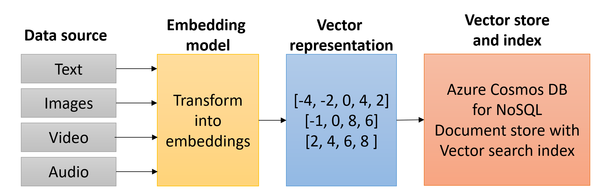

# Use vector search on embeddings in Azure Cosmos DB for NoSQL

## Cosmos DB indexing

Azure Cosmos DB automatically indexes all properties for all items in a container. However, the creation of additional indexes can improve performance and add functionality such as spatial querying and vector search.

The following indexes are supported by Azure Cosmos DB:

The **Range Index** supports efficient execution of queries involving numerical and string data types. It is optimized for inequality comparisons (<, <=, >, >=) and sorting operations. Range indexes are particularly useful for time-series data, financial applications, and any scenario that requires filtering or sorting over a numeric range or alphabetically ordered strings.

The **Spatial Index** excels with geospatial data types such as points, lines, and polygons. Spatial queries include operations such as finding intersections, conducting proximity searches, and handling bounding-box queries. Spatial indexes are crucial for applications that require geographic information system (GIS) capabilities, location-based services, and asset tracking.

The **Composite Index** combines multiple properties into a single entry, optimizing complex queries that use multiple properties for filtering and sorting. They significantly improve the performance of multidimensional queries by reducing the number of request units (RUs) consumed during these operations.

The **Vector Index** is specialized for high-dimensional vector data. Use cases include similarity searches, recommendation systems, and any other application requiring efficient handling of high-dimensional vectors. This index type optimizes the storage and retrieval of vectors typically utilized in AI application patterns such as RAG (Retrieval Augmented Generation).

Learn more about indexing in the [Azure documentation](https://learn.microsoft.com/azure/cosmos-db/index-overview)

## Embeddings and vector search

Embedding is a way of serializing the semantic meaning of data into a vector representation. Because the generated vector embedding represents the semantic meaning, it means that when it is searched, it can find similar data based on the semantic meaning of the data rather than exact text. Data can come from many sources, including text, images, audio, and video. Because the data is represented as a vector, vector search can, therefore, find similar data across all different types of data.

Embeddings are created by sending data to an embedding model, where it is transformed into a vector, which then can be stored as a vector field within its source document in Azure Cosmos DB for NoSQL. Azure Cosmos DB for NoSQL supports the creation of vector search indexes on top of these vector fields. A vector search index is a container of vectors in [latent space](https://idl.cs.washington.edu/papers/latent-space-cartography/) that enables a semantic similarity search across all data (vectors) contained within.



## Why vector search?

Vector search is an important RAG (Retrieval Augmented Generation) pattern component. Large Language Model (LLM) data is trained on a snapshot of public data at a point in time. This data does not contain recent public information, nor does it collect private, corporate information. LLMs are also very broad in their knowledge, and including information from a RAG process can help it focus accurately on a specific domain.

A vector index search allows for a prompt pre-processing step where information can be semantically retrieved from an index and then used to generate a factually accurate prompt for the LLM to reason over. This provides the knowledge augmentation and focus (attention) to the LLM.

In this example, assume textual data is vectorized and stored within an Azure Cosmos DB for NoSQL database. The text data and embeddings/vector field are stored in the same document. A vector search index has been created on the vector field. When a message is received from a chat application, this message is also vectorized using the same embedding model (ex., Azure OpenAI text-embedding-ada-002), which is then used as input to the vector search index. The vector search index returns a list of documents whose vector field is semantically similar to the incoming message. The unvectorized text stored within the same document is then used to augment the LLM prompt. The LLM receives the prompt and responds to the requestor based on the information it has been given.


## Why use Azure Cosmos DB for NoSQL as a vector store?

It is common practice to store vectorized data in a dedicated vector store as vector search indexing is not a common capability of most databases. However, this introduces additional complexity to the solution as the data must be stored in two different locations. Azure Cosmos DB for NoSQL supports vector search indexing, which means that the vectorized data can be stored in the same document as the original data. This reduces the complexity of the solution and allows for a single database to be used for both the vector store and the original data.

## Vector index options in Azure Cosmos DB for NoSQL

Vector indexes are built for enabling efficient similarity searches on vector data stored in Azure Cosmos DB for NoSQL. Azure Cosmos DB for NoSQL supports three types of vector indexes: flat, quantizedFlat, and diskANN. Each index type offers a different balance of accuracy, performance, and resource efficiency, allowing developers to choose the best index type based on their application requirements.

### Flat Index

The **flat index** in Azure Cosmos DB stores vectors alongside other indexed properties and performs searches using a brute-force method. This index guarantees 100% accuracy, meaning it always finds the most similar vectors within the dataset. However, it supports a maximum of 505 dimensions, which may limit its use in scenarios requiring high-dimensional vector searches. The **flat index** is ideal for applications where the highest accuracy is paramount, and the number of vector dimensions is relatively low.

### Quantized Flat Index

The **quantizedFlat** index offers an optimized approach by compressing vectors before storing them, trading a small amount of accuracy for improved performance. Supporting up to 4096 dimensions, this index type provides lower latency and higher throughput compared to the flat index, along with reduced RU consumption. Although the compression may result in slightly less than 100% accuracy, the **quantizedFlat** index is excellent for use cases where query filters narrow down the vector search set, and a balance between performance and high accuracy is desired.

### DiskANN Index

The **diskANN index** leverages advanced vector indexing algorithms developed by Microsoft Research to create an efficient approximate nearest neighbors (ANN) index. This index supports up to 4096 dimensions and offers some of the lowest latency, highest throughput, and lowest RU costs among index types. While the approximate nature of **diskANN** may lead to a slight reduction in accuracy compared to flat and quantizedFlat indexes, it excels in scenarios requiring high-performance, large-scale vector searches with a focus on speed and resource efficiency.

>**Note**: The **quantizedFlat** and **diskANN** indexes requires that at least 1,000 vectors to be inserted. This is to ensure accuracy of the quantization process. If there are fewer than 1,000 vectors, a full scan is executed instead and will lead to higher RU charges for a vector search query. In this lab,  DiskANN is used as the index of choice but keep in mind that it is not taking advantage of the full capabilities of the index.

## Enabling vector search in Azure Cosmos DB for NoSQL

The Cosmos DB account that has been deployed with this guide is already enabled with the capability for vector search. For reference, the following Azure CLI command can be used to enable vector search on an existing Cosmos DB account:

```bash
az cosmosdb update --resource-group <resource-group-name> --name <account-name> --capabilities EnableNoSQLVectorSearch
```

### The vector search profile and vector indexing policy

To perform vector searches with Azure Cosmos DB for NoSQL, the creation and assignment of a vector policy and vector index policy for the container is required. This vector policy provides necessary information for the database engine to efficiently conduct similarity searches on vectors stored within the container's documents. Additionally, the vector policy informs the vector indexing policy if you choose to specify one. A vector policy includes the following information:

- **Path**: Specifies the property that contains the vector. This field is required.
- **Datatype**: Defines the data type of the vector property. The default data type is `Float32`.
- **Dimensions**: Determines the dimensionality or length of each vector in the specified path. All vectors within the path must have the same number of dimensions, with the default being 1536.
- **Distance Function**: Describes the metric used to compute distance or similarity between vectors. Supported functions are: **cosine**, **dotproduct**, and **euclidean**. The default distance function is `cosine`.

The following is an example of a vector policy.

```json
{
    "vectorEmbeddings": [
        {
            "path":"/vector1",
            "dataType":"float32",
            "distanceFunction":"cosine",
            "dimensions":1536
        }
    ]
}
```

The vector indexing policy identifies the vector index type to be used for the index.

The following is an example of a vector indexing policy.

```json
{
    "indexingMode": "consistent",
    "automatic": true,
    "includedPaths": [
        {
            "path": "/*"
        }
    ],
    "excludedPaths": [
        {
            "path": "/_etag/?"
        },
        {
            "path": "/vector1/*"
        }
    ],
    "vectorIndexes": [
        {
            "path": "/vector1",
            "type": "DiskANN"
        }
    ]
}
```

## Lab - Use vector search on embeddings in Azure Cosmos DB for NoSQL

In this lab, a notebook demonstrates how to add an embedding field to a document, create a vector search index, and perform a vector search query. The notebook ends with a demonstration of utilizing vector search with an LLM in a RAG scenario using Azure OpenAI.

This lab requires the Azure OpenAI endpoint and access key to be added to the settings (`.env`) file. Access this information by opening [Azure OpenAI Studio](https://oai.azure.com/portal) and selecting the **Gear**/Settings icon located to the right in the top toolbar.


On the **Settings** screen, select the **Resource** tab, then copy and record the **Endpoint** and **Key** values for use in the lab.


>**NOTE**: This lab can only be completed using a deployed Azure Cosmos DB for NoSQL account due to the use of vector search. The Azure Cosmos DB Emulator does not support vector search.

This lab also requires the data provided in the previous lab titled [Load data into Azure Cosmos DB for NoSQL containers](../08_Load_Data/README.md#lab---load-data-into-azure-cosmos-db-api-for-nosql-containers). Run all cells in this notebook to prepare the data for use in this lab.

>**Note**: It is highly recommended to use a [virtual environment](https://python.land/virtual-environments/virtualenv) for all labs.

Please visit the lab repository to complete [this lab](../Labs/lab_3_cosmosdb_vector_search.ipynb).

Some highlights from the lab include:

### Instantiating an AzureOpenAI client

```python
# Instantiate an AzureOpenAI client
ai_client = AzureOpenAI(
    azure_endpoint = AOAI_ENDPOINT,
    api_version = AOAI_API_VERSION,
    api_key = AOAI_KEY
    )
```

### Vectorizing text using Azure OpenAI

```python
# Generate embedding vectors from a text string
def generate_embeddings(text: str):
    '''
    Generate embeddings from string of text using the deployed Azure OpenAI API embeddings model.
    This will be used to vectorize document data and incoming user messages for a similarity search with the vector index.
    '''
    response = ai_client.embeddings.create(input=text, model=EMBEDDINGS_DEPLOYMENT_NAME)
    embeddings = response.data[0].embedding
    time.sleep(0.5) # rest period to avoid rate limiting on AOAI for free tier
    return embeddings
```

### Adding a vector embedding profile and vector indexing profile to a container

The lab creates an embedding field named `contentVector` in each container and populates the value with the vectorized text of the JSON representation of the document. Currently vector search in Azure Cosmos DB for NoSQL is supported on new containers only. To configure both the container vector policy and any vector indexing policy needs to be done at the time of container creation as it can’t be modified later. Both policies will be modifiable in a future improvement to the preview feature.

```python
# Create the vector embedding policy
vector_embedding_policy = {
    "vectorEmbeddings": [
        {
            "path": "/contentVector",
            "dataType": "float32",
            "distanceFunction": "cosine",
            "dimensions": 1536
        }
    ]
}

# Create the indexing policy
indexing_policy = {
    "indexingMode": "consistent",  
    "automatic": True, 
    "includedPaths": [
        {
            "path": "/*" 
        }
    ],
    "excludedPaths": [
        {
            "path": "/\"_etag\"/?"
        },
        {
            "path": "/contentVector/*"
        }
    ],
    "vectorIndexes": [
        {
            "path": "/contentVector",
            "type": "diskANN"
        }
    ]
}

product_v_container = db.create_container_if_not_exists(
    id="product_v",
    partition_key=PartitionKey(path="/categoryId"),
    indexing_policy=indexing_policy,
    vector_embedding_policy=vector_embedding_policy
)
```


### Performing a vector search query

```python
def vector_search(
        container: ContainerProxy, 
        prompt: str,         
        vector_field_name:str="contentVector", 
        num_results:int=5):
    query_embedding = generate_embeddings(prompt)    
    items = container.query_items(
        query=f"""SELECT TOP @num_results itm.id, VectorDistance(itm.{vector_field_name}, @embedding) AS SimilarityScore 
                FROM itm
                ORDER BY VectorDistance(itm.{vector_field_name}, @embedding)
                """,
        parameters = [
            { "name": "@num_results", "value": num_results },
            { "name": "@embedding", "value": query_embedding }            
        ],
        enable_cross_partition_query=True
        )
    return items
```

### Using vector search results with an LLM in a RAG scenario

```python
def rag_with_vector_search(
        container: ContainerProxy, 
        prompt: str,         
        vector_field_name:str="contentVector", 
        num_results:int=5):
    """
    Use the RAG model to generate a prompt using vector search results based on the
    incoming question.  
    """
    # perform the vector search and build product list
    results = vector_search(container, prompt, vector_field_name, num_results)
    product_list = ""
    for result in results:
        # retrieve the product details
        product = query_item_by_id(container, result["id"], Product)               
        # remove the contentVector field from the product details, this isn't needed for the context
        product.content_vector = None        
        product_list += json.dumps(product, indent=4, default=str) + "\n\n"

    # generate prompt for the LLM with vector results
    formatted_prompt = system_prompt + product_list

    # prepare the LLM request
    messages = [
        {"role": "system", "content": formatted_prompt},
        {"role": "user", "content": prompt}
    ]

    completion = ai_client.chat.completions.create(messages=messages, model=COMPLETIONS_DEPLOYMENT_NAME)
    return completion.choices[0].message.content
```
