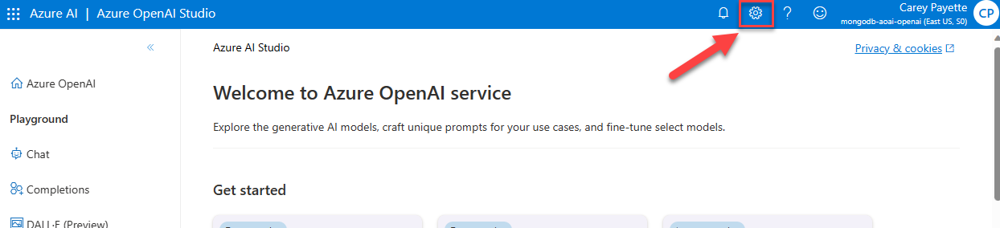

# Use vector search on embeddings in vCore-based Azure Cosmos DB for MongoDB

>**NOTE**: vCore-based Azure Cosmos DB for MongoDB supports vector search on embeddings. This functionality is not supported on RUs-based accounts.

## Embeddings and vector search

Embedding is a way of serializing the semantic meaning of data into a vector representation. Because the generated vector embedding represents the semantic meaning, it means that when it is searched, it can find similar data based on the semantic meaning of the data rather than exact text. Data can come from many sources, including text, images, audio, and video. Because the data is represented as a vector, vector search can, therefore, find similar data across all different types of data.

Embeddings are created by sending data to an embedding model, where it is transformed into a vector, which then can be stored as a vector field within its source document in vCore-based Azure Cosmos DB for MongoDB. vCore-based Azure Cosmos DB for MongoDB supports the creation of vector search indexes on top of these vector fields. A vector search index is a collection of vectors in [latent space](https://idl.cs.washington.edu/papers/latent-space-cartography/) that enables a semantic similarity search across all data (vectors) contained within.


## Why vector search?

Vector search is an important RAG (Retrieval Augmented Generation) pattern component. Large Language Model (LLM) data is trained on a snapshot of public data at a point in time. This data does not contain recent public information, nor does it collect private, corporate information. LLMs are also very broad in their knowledge, and including information from a RAG process can help it focus accurately on a specific domain.

A vector index search allows for a prompt pre-processing step where information can be semantically retrieved from an index and then used to generate a factually accurate prompt for the LLM to reason over. This provides the knowledge augmentation and focus (attention) to the LLM.

In this example, assume textual data is vectorized and stored within an vCore-based Azure Cosmos DB for MongoDB database. The text data and embeddings/vector field are stored in the same document. A vector search index has been created on the vector field. When a message is received from a chat application, this message is also vectorized using the same embedding model (ex., Azure OpenAI text-embedding-ada-002), which is then used as input to the vector search index. The vector search index returns a list of documents whose vector field is semantically similar to the incoming message. The unvectorized text stored within the same document is then used to augment the LLM prompt. The LLM receives the prompt and responds to the requestor based on the information it has been given.


## Why use vCore-based Azure Cosmos DB for MongoDB as a vector store?

It is common practice to store vectorized data in a dedicated vector store as vector search indexing is not a common capability of most databases. However, this introduces additional complexity to the solution as the data must be stored in two different locations. vCore-based Azure Cosmos DB for MongoDB supports vector search indexing, which means that the vectorized data can be stored in the same document as the original data. This reduces the complexity of the solution and allows for a single database to be used for both the vector store and the original data.

## Lab - Use vector search on embeddings in vCore-based Azure Cosmos DB for MongoDB

In this lab, a notebook demonstrates how to add an embedding field to a document, create a vector search index, and perform a vector search query. The notebook ends with a demonstration of utilizing vector search with an LLM in a RAG scenario using Azure OpenAI.

This lab requires the Azure OpenAI endpoint and access key to be added to the settings (`.env`) file. Access this information by opening [Azure OpenAI Studio](https://oai.azure.com/portal) and selecting the **Gear**/Settings icon located to the right in the top toolbar.



On the **Settings** screen, select the **Resource** tab, then copy and record the **Endpoint** and **Key** values for use in the lab.


>**NOTE**: This lab can only be completed using a deployed vCore-based Azure Cosmos DB for MongoDB account due to the use of vector search. The Azure Cosmos DB Emulator does not support vector search.

This lab also requires the data provided in the previous lab titled [Load data into Azure Cosmos DB API for MongoDB collections](../08_Load_Data/README.md#lab---load-data-into-azure-cosmos-db-api-for-mongodb-collections). Run all cells in this notebook to prepare the data for use in this lab.

>**Note**: It is highly recommended to use a [virtual environment](https://python.land/virtual-environments/virtualenv) for all labs.

Please visit the lab repository to complete [this lab](https://github.com/AzureCosmosDB/Azure-OpenAI-Python-Developer-Guide/blob/main/Labs/lab_3_mongodb_vector_search.ipynb).

Some highlights from the lab include:

### Instantiating an AzureOpenAI client

```python
# Instantiate an AzureOpenAI client
ai_client = AzureOpenAI(
    azure_endpoint = AOAI_ENDPOINT,
    api_version = AOAI_API_VERSION,
    api_key = AOAI_KEY
    )
```

### Vectorizing text using Azure OpenAI

```python
# Generate embedding vectors from a text string
def generate_embeddings(text: str):
    '''
    Generate embeddings from string of text using the deployed Azure OpenAI API embeddings model.
    This will be used to vectorize document data and incoming user messages for a similarity search with the vector index.
    '''
    response = ai_client.embeddings.create(input=text, model=EMBEDDINGS_DEPLOYMENT_NAME)
    embeddings = response.data[0].embedding
    time.sleep(0.5) # rest period to avoid rate limiting on AOAI for free tier
    return embeddings
```

### Adding an embedding field to a document

The lab creates an embedding field named `contentVector` in each collection and populates the value with the vectorized text of the JSON representation of the document.

```python
def add_collection_content_vector_field(collection_name: str):
    '''
    Add a new field to the collection to hold the vectorized content of each document.
    '''
    collection = db[collection_name]
    bulk_operations = []
    for doc in collection.find():
        # remove any previous contentVector embeddings
        if "contentVector" in doc:
            del doc["contentVector"]

        # generate embeddings for the document string representation
        content = json.dumps(doc, default=str)
        content_vector = generate_embeddings(content)       
        
        bulk_operations.append(pymongo.UpdateOne(
            {"_id": doc["_id"]},
            {"$set": {"contentVector": content_vector}},
            upsert=True
        ))
    # execute bulk operations
    collection.bulk_write(bulk_operations)
```

### Creating a vector search index

Enabling vector search on the `contentVector` field in the collection.

```python
# Create the products vector index
db.command({
  'createIndexes': 'products',
  'indexes': [
    {
      'name': 'VectorSearchIndex',
      'key': {
        "contentVector": "cosmosSearch"
      },
      'cosmosSearchOptions': {
        'kind': 'vector-ivf',
        'numLists': 1,
        'similarity': 'COS',
        'dimensions': 1536
      }
    }
  ]
})
```

### Performing a vector search query

```python
def vector_search(collection_name, query, num_results=3):
    """
    Perform a vector search on the specified collection by vectorizing
    the query and searching the vector index for the most similar documents.

    returns a list of the top num_results most similar documents
    """
    collection = db[collection_name]
    query_embedding = generate_embeddings(query)    
    pipeline = [
        {
            '$search': {
                "cosmosSearch": {
                    "vector": query_embedding,
                    "path": "contentVector",
                    "k": num_results
                },
                "returnStoredSource": True }},
        {'$project': { 'similarityScore': { '$meta': 'searchScore' }, 'document' : '$$ROOT' } }
    ]
    results = collection.aggregate(pipeline)
    return results
```

### Using vector search results with an LLM in a RAG scenario

```python
def rag_with_vector_search(question: str, num_results: int = 3):
    """
    Use the RAG model to generate a prompt using vector search results based on the
    incoming question.  
    """
    # perform the vector search and build product list
    results = vector_search("products", question, num_results=num_results)
    product_list = ""
    for result in results:
        if "contentVector" in result["document"]:
            del result["document"]["contentVector"]
        product_list += json.dumps(result["document"], indent=4, default=str) + "\n\n"

    # generate prompt for the LLM with vector results
    formatted_prompt = system_prompt + product_list

    # prepare the LLM request
    messages = [
        {"role": "system", "content": formatted_prompt},
        {"role": "user", "content": question}
    ]

    completion = ai_client.chat.completions.create(messages=messages, model=COMPLETIONS_DEPLOYMENT_NAME)
    return completion.choices[0].message.content
```
