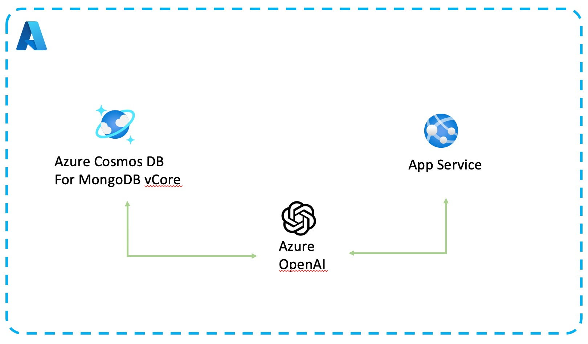

# cosmos-db-openai-python-dev-guide
Azure Cosmos DB + Azure OpenAI Python developer guide

## Outline

- [01_Overview_Cosmos_DB](01_Overview_Cosmos_DB/README.md)
- [02_Overview_Azure_OpenAI](02_Over/README.mdview_Azure_OpenAI)
- [03_Overview_AI_Concepts](03_Overview_AI_Concepts/README.md)
- [04_Explore_OpenAI_models](06_Explore_OpenAI_models/README.md)
- [05_Provision_Azure_Resources](04_Provision_Azure_Resources/README.md)
- [06_Create_First_Cosmos_DB_Project](05_Create_First_Cosmos_DB_Project/README.md)
- [07_Load_Data](08_Load_Data/README.md)
- [08_Vector_Search_Cosmos_DB](07_Vector_Search_Cosmos_DB/README.md)
- [09_LangChain](09_LangChain/README.md)
- [10_Chatbot_API](09_Chatbot_API/README.md)
- [11_User_Interface](10_User_Interface/README.md)

# Architecture

