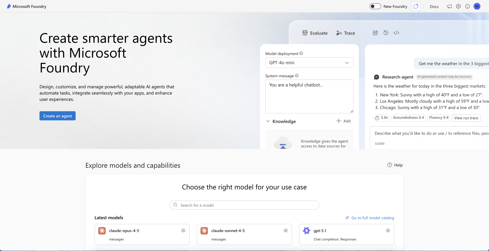

# Overview of Azure OpenAI in Foundry Models and Foundry Tools

Azure OpenAI is a collaboration between Microsoft Azure and OpenAI, a leading research organization in artificial intelligence.
It is a cloud-based platform that enables developers and data scientists to build and deploy AI models quickly and easily.
With Azure OpenAI, users can access a wide range of AI tools and technologies to create intelligent applications, including natural language processing, computer vision, and deep learning.

Azure OpenAI is designed to accelerate the development of AI applications, allowing users to focus on creating innovative solutions that deliver value to their organizations and customers.

Here are ways that Azure OpenAI can help developers:

- **Simplified integration** - Simple and easy-to-use APIs for tasks such as text generation, summarization, sentiment analysis, language translation, and more.
- **Pre-trained models** - AI models that are already fine-tuned on vast amounts of data making it easier for developers to leverage the power of AI without having to train their own models from scratch.
- **Customization** - Developers can also fine-tune the included pre-trained models with their own data with minimal coding, providing an opportunity to create more personalized and specialized AI applications.
- **Documentation and resources** - Azure OpenAI provides comprehensive documentation and resources to help developers get started quickly.
- **Scalability and reliability** - Hosted on Microsoft Azure, the OpenAI service provides robust scalability and reliability that developers can leverage to deploy their applications.
- **Responsible AI** - Azure OpenAI promotes responsible AI by adhering to ethical principles, providing explainability tools, governance features, diversity and inclusion support, and collaboration opportunities.
These measures help ensure that AI models are unbiased, explainable, trustworthy, and used in a responsible and compliance manner.
- **Community support** - With an active developer community developers can seek help via forums and other community support channels.

## Comparison of Azure OpenAI in Foundry Models and OpenAI

Azure OpenAI Service gives customers advanced language AI with OpenAI GPT-4, GPT-3, Codex, DALL-E, and Whisper models with the security and enterprise promise of Azure.
Azure OpenAI co-develops the APIs with OpenAI, ensuring compatibility and a smooth transition from one to the other.

With Azure OpenAI, customers get the security capabilities of Microsoft Azure while running the same models as OpenAI.
Azure OpenAI offers private networking, regional availability, and responsible AI content filtering.

## Data Privacy and Security

Azure OpenAI in Foundry Models stores and processes data to provide the service and monitor for uses that violate applicable product terms. Azure OpenAI in Foundry Models is fully controlled by Microsoft. Microsoft hosts the OpenAI models in Microsoft Azure and does not interact with any services operated by OpenAI.

**Your data privacy is protected:**

Your prompts (inputs), completions (outputs), embeddings, and training data:

- Are NOT available to other customers
- Are NOT available to OpenAI
- Are NOT used to improve OpenAI models
- Are NOT used to improve any Microsoft or third-party products or services
- Are NOT used for automatically improving Azure OpenAI models (models are stateless unless you explicitly fine-tune them with your own training data)

**Your fine-tuned models:**

- Fine-tuned Azure OpenAI in Foundry Models models are available exclusively to the account that created them

## Azure AI Platform

Developers can use the power of AI, cloud-scale data, and cloud-native app development to create highly differentiated digital experiences and establish leadership among competitors.
Build or modernize intelligent applications that take advantage of industry-leading AI technology and leverage real-time data and analytics to deliver adaptive, responsive, and personalized experiences.

The Azure platform of managed AI, containers, and database services, along with offerings developed by or in partnership with key software vendors, enables developers to build, deploy, and scale applications with speed, flexibility, and enterprise-grade security.
This platform has been used by market leaders like The NBA, H&R Block, Real Madrid Football Club, Bosch, and Nuance to develop their own intelligent apps.

Developers can use Foundry Tools, along with other Azure services, to build and modernize intelligent apps on Azure.
Examples of this could be:

- Build new with Azure Kubernetes Service or Azure Container Apps, Azure Cosmos DB, and Foundry Tools
- Modernize with Azure Kubernetes Service, Azure SQL or Azure Database for PostgresSQL, and Foundry Tools

### Foundry Tools

While this guide focuses on building intelligent apps using Azure OpenAI combined with Azure Cosmos DB for NoSQL, the Azure AI Platform consists of many additional AI services.
Each AI service is built to fit a specific AI and/or Machine Learning (ML) need.

Here's a list of [Foundry Tools](https://learn.microsoft.com/azure/ai-services/what-are-ai-services) within Microsoft Foundry:

| Service | Description |
| --- | --- |
| Azure AI Search | Bring AI-powered cloud search to mobile and web apps |
| Azure OpenAI | Perform a wide variety of natural language tasks |
| Bot Service | Create bots and connect them across channels |
| Content Safety | An AI service that detects unwanted contents |
| Custom Vision | Customize image recognition to fit the business |
| Document Intelligence | Turn documents into usable data at a fraction of the time and cost |
| Face | Detect and identify people and emotions in images |
| Immersive Reader | Help users read and comprehend text |
| Language | Build apps with industry-leading natural language understanding capabilities |
| Machine Learning | ML professionals, data scientists, and engineers can use Azure Machine Learning in their day-to-day workflows to train and deploy models, such as those built from an open-source platform, such as PyTorch, TensorFlow, or scikit-learn |
| Speech | Speech to text, text to speech, translation and speaker recognition |
| Translator | Translate more than 100 languages and dialects |
| Video Indexer | Extract actionable insights from videos |
| Vision | Analyze content in images and videos |

> **Note:** Follow this link for additional tips to help in determining the which Foundry Tools is most appropriate for a specific project requirement: [Azure AI products](https://azure.microsoft.com/products/category/ai)

The tools that used to customize and configure models are different from those used to call the Foundry Tools.
Out of the box, most Foundry Tools allow for sending data and receive insights without any customization.

For example:

- Sending an image to the Azure AI Vision service to detect words and phrases or count the number of people in the frame
- Sending an audio file to the Speech service and get transcriptions and translate the speech to text at the same time

Azure offers a wide range of tools that are designed for different types of users, many of which can be used with Foundry Tools.
Designer-driven tools are the easiest to use, and are quick to set up and automate, but might have limitations when it comes to customization.
The REST APIs and client libraries provide users with more control and flexibility, but require more effort, time, and expertise to build a solution.
When using REST APIs and client libraries, there is an expectation that the developer is comfortable working with modern programming languages like C#, Java, Python, JavaScript, or another popular programming language.

### Azure Machine Learning

[Azure Machine Learning](https://learn.microsoft.com/azure/machine-learning/overview-what-is-azure-machine-learning?view=azureml-api-2) is a cloud service for accelerating and managing the machine learning (ML) project lifecycle.
ML professionals, data scientists, and engineers can use it in their day-to-day workflows to train and deploy models and manage machine learning operations (MLOps).

Azure Machine Learning can be used to create a model or use a model built from an open-source platform, such as PyTorch, TensorFlow, or scikit-learn.
Additionally, MLOps tools help monitor, retrain, and redeploy models.

ML projects often require a team with a varied skill set to build and maintain.
Azure Machine Learning has tools that help enable:

- Collaboration within a team via shared notebooks, compute resources, serverless compute, data, and environments

- Developing models for fairness and explainability, tracking and auditability to fulfill lineage and audit compliance requirements

- Deploying ML models quickly and easily at scale, and manage and govern them efficiently with MLOps

- Running machine learning workloads anywhere with built-in governance, security, and compliance

Enterprises working in the Microsoft Azure cloud can use familiar security and role-based access control for infrastructure.
A project can be set up to deny access to protected data and select operations.

#### Azure Machine Learning vs Azure Open AI

Many of the Foundry Tools are suited to a very specific AI / ML need.
The Azure Machine Learning and Azure OpenAI services offer more flexible usage based on the solution requirements.

Here are a couple differentiators to help determine which of these to services to use when comparing the two:

- Azure Machine Learning service is appropriate for solutions where a custom model needs to be trained specifically on private data.

- Azure OpenAI service is appropriate for solutions that require pre-trained models that provide natural language processing or vision services, such as the GPT (gpt-5, gpt-5-mini), DALL-E (DALL-E 3), or Sora (Sora-2) models from OpenAI.

If the solution requires other more task specific AI features, then one of the other Foundry Tools should be considered.

### Microsoft Foundry

Microsoft Foundry is a unified Azure platform for building and deploying generative AI applications. It provides developers with an integrated environment that combines models, tools, and infrastructure in one place.

**Key capabilities:**

- Access to a comprehensive model catalog with models from OpenAI, Meta, and other providers
- Interactive playgrounds for testing and refining AI applications
- Built-in evaluation and monitoring tools for quality assurance
- Integration with Foundry Tools for speech, vision, language, document intelligence, and content safety
- Collaboration features for teams working on AI projects

Microsoft Foundry is designed for building custom copilot applications and other solutions powered by large language models (LLMs).

**Common workflows in Microsoft Foundry:**

- Deploy models from the catalog to real-time inferencing endpoints
- Build and test generative AI applications using interactive playgrounds
- Implement retrieval augmented generation (RAG) by integrating custom data sources
- Evaluate model performance and application quality
- Add content safety filters to mitigate potential harms
- Extend applications with additional AI capabilities from Foundry Tools
