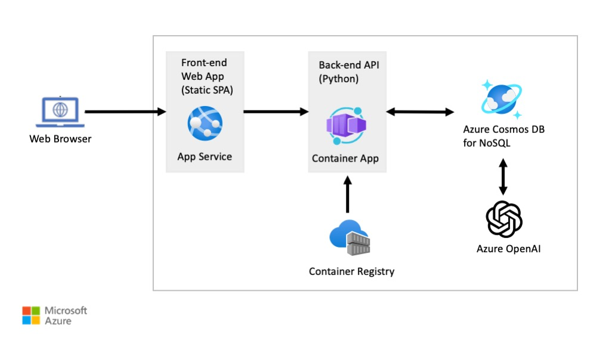

# Provision Azure resources (Azure Cosmos DB workspace, Azure OpenAI, etc.)

As the guide walks you through the concepts of integrating Azure Cosmos DB for NoSQL and Azure OpenAI, the hands-on labs will also guide you through building a sample solution.
The focus of this guide and the labs is limited to Azure Cosmos DB for NoSQL, vector search capabilities powered by DiskANN, Azure OpenAI, and the Python programming language.
With this focus, the labs include an Azure Bicep template that will deploy the following Azure resources the solution will be deployed to:

- Azure Resource Group
- Azure Cosmos DB for NoSQL
- Azure OpenAI
  - ChatGPT-3.5 `completions` model
  - text-embedding-3-small model `embeddings` model
- Azure App Service - for hosting the front-end, static SPA web application written in React
- Azure Container App - for hosting the Back-end API application written in Python
- Azure Container Registry - to host Docker images of backend, API application

## Architecture Diagram

Once the Azure resources are provisioned, this guide will walk you through everything that is necessary to build the Back-end API application written in Python.

The Front-end Web App is a static SPA application written in React.
Since React is outside the scope of this guide, the Front-end Web App is pre-built for you and will be configured automatically on deployment.
You do not need any experience with React in order to complete the labs in this guide.

## Lab - Provision Azure Resources

This lab will walk you through deploying the Azure resources necessary for the solution built in this guide.
The deployment will be done using an Azure Bicep template that is configured to provision all the necessary resources.

> **Note**: You will need an Azure Subscription and have the necessary permissions to provision the Azure resources.

Please visit the lab repository to complete [this lab](/diskann/Labs/deploy/deploy.md).
