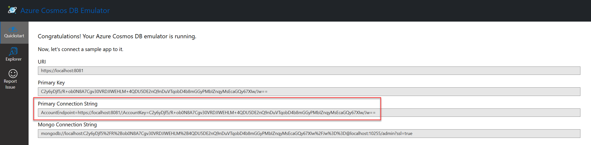
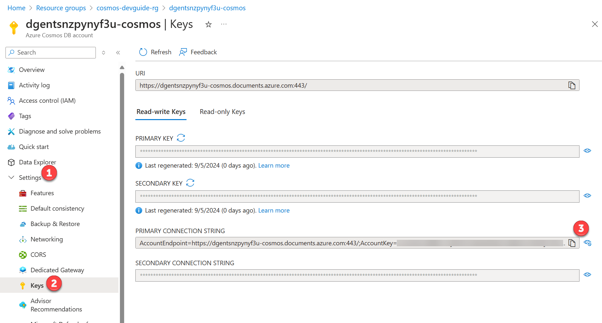

# Create your first Azure Cosmos DB project

This section will cover how to create your first Azure Cosmos DB project.
We'll use a notebook to demonstrate the basic CRUD operations.
We'll also cover using the Azure Cosmos DB Emulator to test code locally.

## Emulator support

Azure Cosmos DB has an emulator that can be used to develop code locally.
The emulator supports the API for NoSQL and the API for MongoDB.
The use of the emulator does not require an Azure subscription, nor does it incur any costs, so it is ideal for local development and testing.
The Azure Cosmos DB emulator can also be utilized with unit tests in a [GitHub Actions CI workflow](https://learn.microsoft.com/azure/cosmos-db/how-to-develop-emulator?tabs=windows%2Cpython&pivots=api-nosql#use-the-emulator-in-a-github-actions-ci-workflow).

There is not 100% feature parity between the emulator and the cloud service.
Visit the [Azure Cosmos DB emulator](https://learn.microsoft.com/azure/cosmos-db/emulator) documentation for more details.

For Windows machines, the emulator can be installed via an installer.
For both Windows and Linux there is also a Docker image available.

Learn more about the pre-requisites and installation of the emulator [here](https://learn.microsoft.com/azure/cosmos-db/how-to-develop-emulator?tabs=windows%2Cpython&pivots=api-nosql).

### Retrieving the connection string from the Azure Cosmos DB Emulator

The splash screen or **Quickstart** section of the Azure Cosmos DB Emulator will display the connection string.
Access this screen through the following URL: `https://localhost:8081/_explorer/index.html`.



**The Azure Cosmos DB emulator does not support vector search.
To complete the vector search and AI-related labs, an Azure Cosmos DB for NoSQL account in Azure is required.**

## Authentication

Authentication to Azure Cosmos DB for NoSQL uses a connection string.
The connection string is a URL that contains the authentication information for the Azure Cosmos DB account or local development environment.
The username and password used when provisioning the Azure Cosmos DB for NoSQL service are used in the connection string when authenticating to Azure.

### Retrieving the connection string from the Azure portal

Retrieve the connection string from the Azure portal by navigating to the Azure Cosmos DB account and selecting the **Connection String** menu item on the left-hand side of the screen.
The connection string contains tokens for the username and password that must be replaced with the username and password used when provisioning the Azure Cosmos DB for NoSQL service.



## Lab - Create your first Cosmos DB for NoSQL application

Using a notebook, we'll create a Cosmos DB for the NoSQL application in this lab using the **azure-cosmos** library and the Python language.
Both the Azure Cosmos DB Emulator and Azure Cosmos DB account in Azure are supported for completion of this lab.

> **Note**: It is highly recommended to use a [virtual environment](https://python.land/virtual-environments/virtualenv) for all labs.
Please visit the lab repository to complete [this lab](/diskann/Labs/lab_1_first_application.ipynb).

The following concepts are covered in detail in this lab:

### Creating a database client

The `azure-cosmos` package is used to create an Azure Cosmos DB for NoSQL database client.
The client enables both DDL (data definition language) and DML (data manipulation language) operations.

```python
# Initialize the Azure Cosmos DB client
client = CosmosClient.from_connection_string(CONNECTION_STRING)
```

### Creating a database

```python
db: DatabaseProxy = client.create_database(database_name)
```

### Creating a container

The `create_container_if_not_exists` method is used to create a container.
If the container already exists, the method will retrieve the existing container.

```python
container: ContainerProxy = db.create_container_if_not_exists(
  id="product",
  partition_key={"paths": ["/categoryId"], "kind": "Hash"}                                    
)
```

### Creating or updating a document (upsert)

One method of creating a document is using the `create_item` method.
This method takes a single document and inserts it into the database, if the item already exists in the container, and exception is thrown.
Alternatively, the `upsert_item` method can also be used to insert a document into the database and in this case, if the document already exists, it will be updated.

```python
# Create a document
container.upsert_item(product_dict)
```

### Reading documents

The `read_item` method can be used to retrieve a single document if both the `id` value and `partition_key` value are known.
Otherwise, the `query_items` method can be used to retrieve a list of documents using a [SQL-like query](https://learn.microsoft.com/azure/cosmos-db/nosql/tutorial-query).

```python
items = container.query_items(query="SELECT * FROM prod", enable_cross_partition_query=True)
```

### Updating a document

The `replace_item` method is used to update a single document in a container.
The method returns a product dictionary object.

```python
update_result = container.replace_item(
    item=product_id,
    body={**retrieved_product, "name": new_name}
)
```

### Deleting a document

The `delete_item` method is used to delete a single document from a container.

```python
container.delete_item(item=product.id, partition_key=product.category_id)
```

