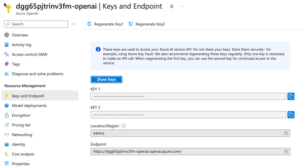

# Explore the Azure OpenAI models and endpoints (console app)

## Azure OpenAI Models

Azure Open AI is powered by a diverse set of models with different capabilities [Azure OpenAI models]https://learn.microsoft.com/azure/ai-foundry/foundry-models/concepts/models-sold-directly-by-azure).

| Model      | Description |
| ---------- | ----------- |
| GPT-5.1 series (gpt-5.1, gpt-5.1-chat, gpt-5.1-codex, gpt-5.1-codex-mini) | The latest general purpose models from Open AI |
| Video generation (sora-2, sora) | A model that can generate original video scenes from text instructions. |
| GPT-5 series (gpt-5, gpt-5-mini, gpt-5-nano, gpt-5-chat) | General purpose models that improve upon GPT 4.1 models | 
| gpt-oss | open-weight reasoning models |
| codex-mini | A Fine-tuned version of o4-mini. |
| GPT-4.1 series (gpt-4.1, gpt-4.1-mini, gpt-4.1-nano) | General purpose models that improve upon GPT 4 models |
| model-router | A model that intelligently selects from a set of underlying chat models to respond to a given prompt. |
| computer-use-preview | An experimental model trained for use with the Responses API computer use tool. |
| o-series models | Reasoning models with advanced problem solving and increased focus and capability. |
| GPT-4o, GPT-4o mini, and GPT-4 Turbo | Capable Azure OpenAI models with multimodal versions, which can accept both text and images as input. |
| Embeddings | A set of models that can convert text into numerical vector form to facilitate text similarity. |
| Image generation (dall-e-2, gpt-image-1) | A series of models that can generate original images from natural language. |
| Audio (gpt-realtime, gpt-audio, etc) | A series of models for speech to text, translation, and text to speech. |
| Whisper    | A series of models that can transcribe and translate speech to text. |

NOTE that model availability varies by region.
You can use [Azure OpenAI models]https://learn.microsoft.com/azure/ai-foundry/foundry-models/concepts/models-sold-directly-by-azure) to determine the regional availability of any model.

### GPT models

All of the newer GPT models are language models that are optimized for conversational interfaces.
Previous models were text-in and text-out, meaning they accepted a prompt string and returned a completion to append to the prompt.
However, GPT-35-Turbo and GPT-4 models and beyond are conversation-in and message-out.
The models expect input formatted in a specific chat-like transcript format, and return a completion that represents a model-written message in the chat.
While this format was designed specifically for multi-turn conversations, it can also work well for non-chat scenarios.

### Embeddings

Embedding models are designed to turn language into a numerical representation called a vector.
You can measure how similar chunks of language are by measuring their cosine similarity (distance).
`text-embedding-3-large` is the latest and most capable embedding model.
NOTE: You can't upgrade between embeddings models. To move from using text-embedding-ada-002 to text-embedding-3-large, you need to generate new embeddings.

OpenAI reports that testing shows that both the large and small third generation embeddings models offer better average multi-language retrieval performance with the MIRACL benchmark. They still maintain performance for English tasks with the MTEB benchmark.

Embeddings are commonly used for the following:

- **Search** - results are ranked by relevance to a query string
- **Clustering** - text strings are grouped by similarity
- **Recommendations** - items with related text strings are recommended
- **Anomaly detection** - outliers with little relatedness are identified
- **Diversity measurement** - similarity distributions are analyzed
- **Classification** - text strings are classified by their most similar label

### DALL-E

DALL-E is a model that can generate an original images from a natural language text description given as input.

### Whisper

Whisper is a speech recognition model, designed for general-purpose applications.
Trained on an extensive dataset encompassing diverse audio inputs, and operates as a multi-tasking model capable of executing tasks like multilingual speech recognition, speech translation, and language identification.

## Selecting an LLM

Before a Large Language Model (LLM) can be implemented into a solution, an LLM model must be chosen.
For this the business use case and other aspects to the overall goal of the AI solution will need to be defined.

Once the business goals of the solution are known, there are a few key considerations to think about:

- **Business Use Case** - What are the specific tasks the business needs the AI solution to perform?
Each LLM is designed for different goals, such as text generation, language translation, image generation, answering questions, code generation, etc.
- **Pricing** - For cases where there may be multiple LLMs to choose from, the [pricing of Azure Open AI](https://azure.microsoft.com/pricing/details/cognitive-services/openai-service/) could be a factor to consider.
For example, when choosing between older models and newer ones, it may be worth to consider that the overall cost of newer models may be higher than an older one for the solution since newer ones require more compute power behind the scenes than older models.
Also, you should consider using a mini model when performing tasks which require less reaasoning.
- **Accuracy** - For cases where there may be multiple LLMs to choose from, the comparison of accuracy between them may be a factor to consider.
For example, newer models may offer improvements over older ones and depending on the use case, new models may provide increased accuracy.
- **Quotas and limits** - There are [Azure Open AI quotas and limits](https://learn.microsoft.com/azure/ai-foundry/openai/quotas-limits) on using the service. This may affect the performance and pricing of the AI solution.
Additionally, some of quotas and limits may vary depending on the Azure Region that is used to host the Azure OpenAI service.
The potential impact of these on the pricing and performance of the solution will want to be considered in the design phase of the solution.

## Do I use an out-of-the-box model or a fine-tuned model?

A base model is a model that hasn't been customized or fine-tuned for a specific use case.
Fine-tuned models are customized versions of base models where a model's weights are trained on a unique set of prompts.
Fine-tuned models achieve better results on a wider number of tasks without needing to provide detailed examples for in-context learning as part of the completion prompt.

The [fine-tuning guide](https://learn.microsoft.com/azure/ai-foundry/openai/how-to/fine-tuning) can be referenced for more information.

## Explore and use Azure OpenAI models from code

The `key` and `endpoint` necessary to make API calls to Azure OpenAI can be located on **Azure OpenAI** blade in the Azure Portal on the **Keys and Endpoint** pane.

## Lab: Explore and use Azure OpenAI models from code

This lab demonstrates using an Azure OpenAI model to obtain a completion response using Python.

> **Note**: It is highly recommended to use a [virtual environment](https://python.land/virtual-environments/virtualenv) for all labs.
Visit the lab repository to complete [this lab](/vcore/Labs/lab_0_explore_and_use_models.ipynb).
