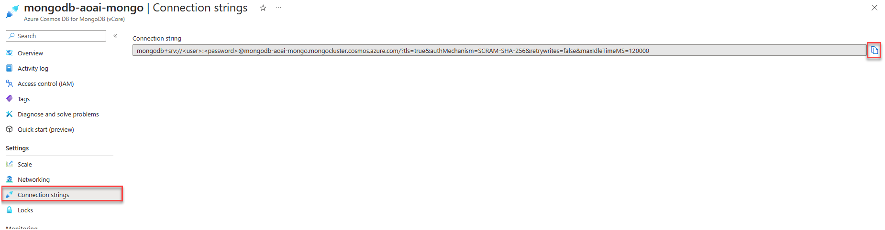

# Create your first Azure Cosmos DB project

This section will cover how to create your first Azure Cosmos DB project.
We'll use a notebook to demonstrate the basic CRUD operations.
We'll also cover using a local DocumentDB Docker container to test code locally.

## Local development support

For local development and testing, the [DocumentDB Docker container](https://github.com/microsoft/documentdb) can be used.
This approach does not require an Azure subscription and is ideal for local development.

Run the DocumentDB container using Docker:

```console
docker pull ghcr.io/documentdb/documentdb/documentdb-local:latest

docker run -dt -p 10260:10260 --name documentdb-local ghcr.io/documentdb/documentdb/documentdb-local:latest --username <YOUR_USERNAME> --password <YOUR_PASSWORD>
```

### Retrieving the connection string for local development

The connection string for the local DocumentDB container is:
`mongodb://<USERNAME>:<PASSWORD>@localhost:10260/?tls=true&tlsAllowInvalidCertificates=true`

Replace `<USERNAME>` and `<PASSWORD>` with the credentials you specified when starting the container.

**The local DocumentDB container does not support vector search.
To complete the vector search and AI-related labs, an Azure DocumentDB cluster in Azure is required.**

## Authentication

Authentication to Azure DocumentDB uses a connection string.
The connection string is a URL that contains the authentication information for the Azure Cosmos DB account or local development environment.
The username and password used when provisioning the Azure DocumentDB service are used in the connection string when authenticating to Azure.

### Retrieving the connection string from the Azure portal

Retrieve the connection string from the Azure portal by navigating to the Azure Cosmos DB account and selecting the **Connection String** menu item on the left-hand side of the screen.
The connection string contains tokens for the username and password that must be replaced with the username and password used when provisioning the Azure DocumentDB service.



## Lab - Create your first Cosmos DB for MongoDB application

Using a notebook, we'll create a Cosmos DB for the MongoDB application in this lab using the **pymongo** library and the Python language.
Both the Azure Cosmos DB Emulator and Azure Cosmos DB account in Azure are supported for completion of this lab.

> **Note**: It is highly recommended to use a [virtual environment](https://python.land/virtual-environments/virtualenv) for all labs.
Please visit the lab repository to complete [this lab](/vcore/Labs/lab_1_first_application.ipynb).

The following concepts are covered in detail in this lab:

### Creating a database client

The `pymongo` package is used to create an Azure DocumentDB database client.
The client enables both DDL (data definition language) and DML (data manipulation language) operations.

```python
client = pymongo.MongoClient(CONNECTION_STRING)
```

### Creating a database

When using the MongoClient, the creation of a database is automatic when referenced.
No specific api calls to create a database are required, if a database already exists, a reference to the database is returned.

> **Note:**: That the creation of databases and collections are lazy, meaning they will not be created until a document is inserted into a collection.

```python
db = client.cosmic_works
```

### Creating a collection

Similar behavior to the creation of a database is experienced when creating a collection.
If the collection does not exist, it will be created once a document is inserted into the collection.

```python
collection = db.products
```

### Creating a document

The `insert_one` method is used to insert a document into a collection.
The document is a product dictionary object.

```python
# Insert the JSON into the database, and retrieve the inserted/generated ID
result = collection.insert_one(product_json)
product_id = result.inserted_id
```

### Reading a document

The `find_one` method is used to retrieve a single document from a collection.
The method returns a product dictionary object.

```python
retrieved_document = collection.find_one({"_id": product_id})
```

### Updating a document

The `find_one_and_update` method is used to update a single document in a collection.
The method returns a product dictionary object.

```python
update_result = collection.find_one_and_update(
    {"_id": product_id},
    {"$set": {"name": retrieved_product.name}},
    return_document=pymongo.ReturnDocument.AFTER
)
```

### Deleting a document

The `delete_one` method is used to delete a single document from a collection.

```python
delete_result = collection.delete_one({"_id": product_id})
```

### Querying documents

The `find` method is used to query documents from a collection.
The method returns a cursor object.

```python
# Print all documents that have a category name of "Components, Saddles"
for result in collection.find({"categoryName": "Components, Saddles"}):
    pprint(result)
```

