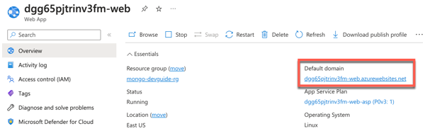
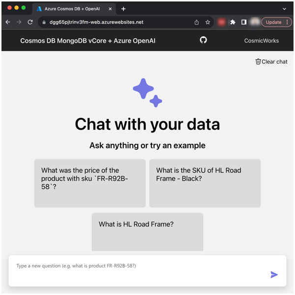
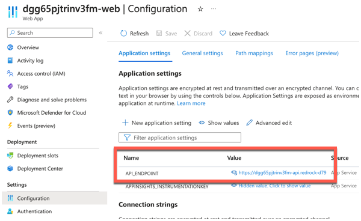
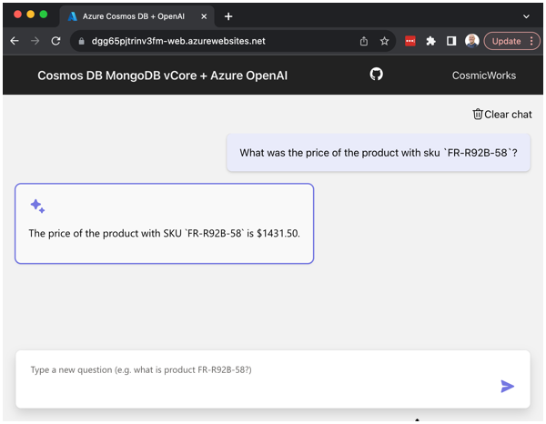

# Connect the chat user interface with the chatbot API

In the previous lab, the backend API code was configured and deployed. The backend API integrates vCore-based Azure Cosmos DB for MongoDB with Azure OpenAI. When the Azure resource template for this lab was run to deploy the necessary Azure resources, a front-end web application written as a SPA (single page application) in React was deployed.

The URL to access this front-end application within the Azure Portal on the **Web App** resource with the name that ends with **-web**.

The following screenshot shows where to find the front-end application URL:

Navigating to this URL in the browser accesses the front-end application. Through this front-end application User Interface, questions can be submitted to the Azure OpenAI model about the CosmicWorks company data, then it will generate responses accordingly.

While the code for the SPA web application is outside the scope of this dev guide. It's worth noting that the Web App is configured with the URL for the Backend API using the **Application setting** named `API_ENDPOINT`. When the application was deployed as part of the Azure template deployment, it was automatically configured with this URL to connect the front-end SPA web application to the Backend API.

## Ask questions about data and observe the responses

To ask the AI questions about the CosmicWorks company data, type the questions in to the front-end application chat user interface. The web application includes tiles with a couple example questions to get started. To use these, simply click on the question tile and it will generate an answer.

These example questions are:
- What was the price of the product with sku `FR-R92B-58`?
- What is the SKU of HL Road Frame - Black?
- What is HL Road Frame?

> **Note**: It's possible the first time you ask a question within the Front end application there may be an error. Occasionally when the Azure Bicep template deploys the front end application there will be an issue configuring the use of the `API_ENDPOINT` app setting. If this happens, simply navigate to **Deployment** -> **Deployment Center**, then click **Sync** to have the Web App refresh the deployment of the front end app from it's GitHub repository source code. This should fix that error.

The chat user interface presents as a traditional chat application style interface when asking questions.

Go ahead, ask the service a few questions about CosmicWorks and observe the responses.

## What do I do if the responses are incorrect?

It's important to remember the model is pre-trained with data, given a system message to guide it, in addition to the company data it has access to via vCore-based Azure Cosmos DB for MongoDB. There are times when the Azure OpenAI model may generate an incorrect response to the prompt given that is either incomplete or even a hallucination (aka includes information that is not correct or accurate).

There are a few options of how this can be handled when the response is incorrect:

1. Provide a new prompt that includes more specific and structured information that can help the model generate a more accurate response.
2. Include more data in the library of company information the model has access to. The incorrect response may be a result of data or information about the company that is missing currently.
3. Use Prompt Engineering techniques to enhance the System message and/or Supporting information provided to guide the model.

While it may be simple to ask the model questions, there are times when Prompt Engineering skills may be necessary to get the most value and reliable responses from the AI model.

## What happens when I start exceeding my token limits?

A Token in Azure OpenAI is a basic unit of input and output that the service processes. Generally, the models understand and process text by breaking it down into tokens.

For example, the word `hamburger` gets broken up into the tokens `ham`, `bur` and `ger`, while a short and common word like `pear` is a single token. Many tokens start with a whitespace, for example ` hello` and ` bye`.

The total number of tokens processed in a given request depends on the length of the input, output and request parameters. The quantity of tokens being processed will also affect the response latency and throughput for the models.

> **Note**: The [pricing of the Azure OpenAI](https://azure.microsoft.com/pricing/details/cognitive-services/openai-service/) service is primarily based on token usage.

### Exceeding Token Quota Limits

Azure OpenAI has **tokens per minute** quota limits on the service. This quota limit, is based on the OpenAI model being used and the Azure region it's hosted in.

> **Note**: The [Azure OpenAI Quotas and limits documentation](https://learn.microsoft.com/azure/ai-services/openai/quotas-limits) contains further information on the specific quotas per OpenAI model and Azure region.

If an applications usage of an Azure OpenAI model exceeds the token quota limits, then the service will respond with a **Rate Limit Error** (Error code 429).

When this error is encountered, there are a couple options available for handling it:

- **Wait a minute** - With the tokens quota limit being a rate limits of the maximum number of tokens allowed per minute, the application will be able to send more prompts to the model again after the quota resets each minute.
- **Request a quota increase** - It may be possible to get Microsoft to increase the token quota to a higher limit, but it's not guaranteed to be approved. This request can be made at [https://aka.ms/oai/quotaincrease](https://aka.ms/oai/quotaincrease)

### Tips to Minimize Token Rate Limit Errors

Here are a few tips that can help to minimize an applications token rate limit errors:

- **Retry Logic** - Implement retry logic in the application so it will retry the call to the Azure OpenAI model, rather than throwing an exception the first time. This is generally best practices when consuming external APIs from applications so they can gracefully handle any unexpected exceptions.
- **Scale Workload Gradually** - Avoid increasing the workload of the application too quickly. By gradually increasing the scale of the workload.
- **Asynchronous Load Patterns** - While there are time sensitive operations that will require a response immediately, there are also operations that are able to be run more asynchronously. Background processes or other similar operations could be build in a way to perform a combination of rate limiting the applications own usage of the model, or even delaying calls until periods of the day where the application is under less load.
- **Set `max_tokens`** - Setting a lower `max_tokens` when calling the service when a short response is expected will limit the maximum number of tokens allowed for the generated answer.
- **Set `best_of`** - Setting a lower `best_of` when calling the service enables the application to control the number of candidate completions generated and how many to return from the service.

### Exceeding Token Limit for System message

When configuring a System message to guide the generated responses, there is a limit on how long the System message can be. The token limit for the System message is 400 tokens.

If the System message provided is more than 400 tokens, the rest of the tokens beyond the first 400 will be ignored.
