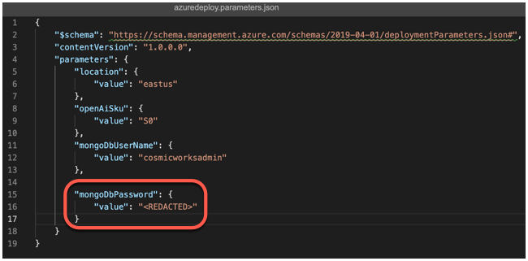

# Solution deployment

## Prerequisites

- Owner on Azure subscription
- Account approved for Azure OpenAI service
- Azure CLI installed
- Azure PowerShell installed

## Clone the repository

Create a folder to house the repository. Open a terminal and navigate to the folder. Clone the repository, then navigate to the `Labs/deploy` folder within the repository.

```bash
git clone https://github.com/AzureCosmosDB/Azure-OpenAI-Python-Developer-Guide.git

cd Azure-OpenAI-Python-Developer-Guide
cd Labs
cd deploy
```

Open the `azuredeploy.parameters.json` file, then edit the `mongoDbPassword` to a password you wish to use for the MongoDB Admin User:



When the Azure Bicep template is deployed, this parameters file will be used to configure the Mongo DB Password and other parameters when provisioning the Azure resources.

## Login to Azure

Open a terminal window and log in to Azure using the following command:

```Powershell
Connect-AzAccount
```

### Set the desired subscription (Optional)

If you have more than one subscription associated with your account, set the desired subscription using the following command:

```Powershell
Set-AzContext -SubscriptionId <subscription-id>
```

## Create resource group

```Powershell
New-AzResourceGroup -Name mongo-devguide-rg -Location 'eastus'
```

## Deploy using bicep template

Deploy the solution resources using the following command (this will take a few minutes to run):

```Powershell
New-AzResourceGroupDeployment -ResourceGroupName mongo-devguide-rg -TemplateFile .\azuredeploy.bicep -TemplateParameterFile .\azuredeploy.parameters.json -c
```
