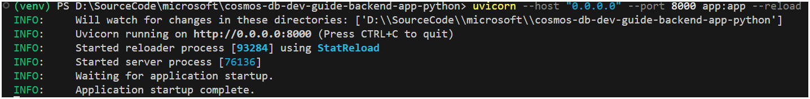
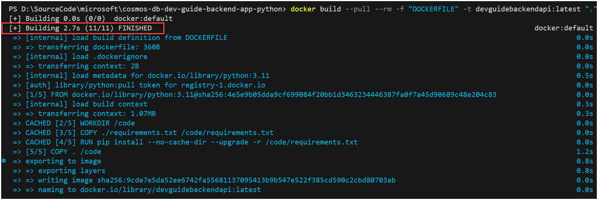
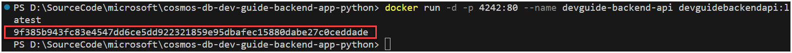
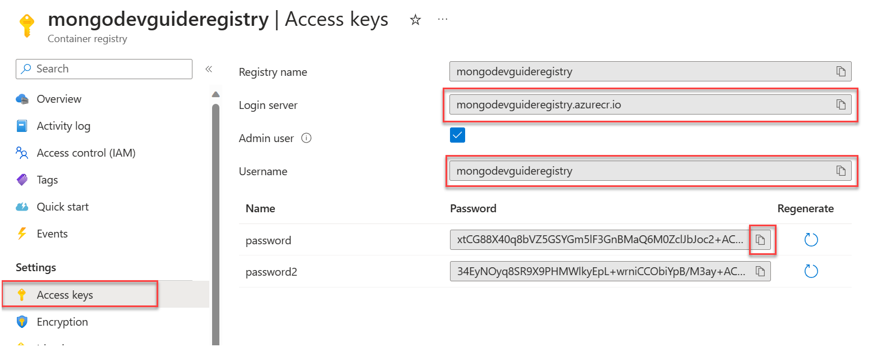
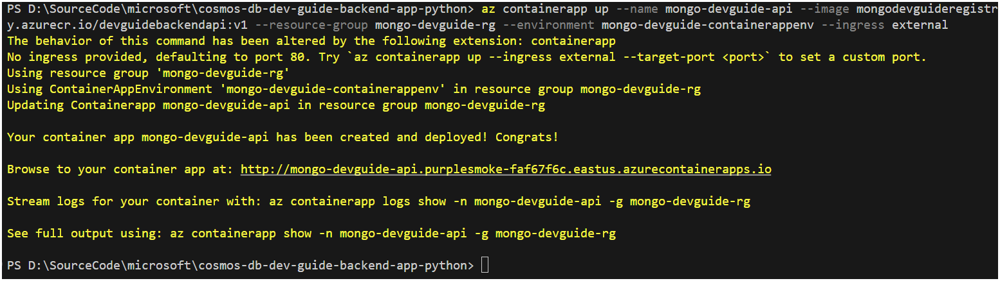
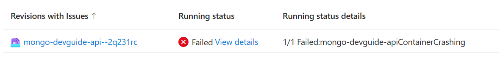
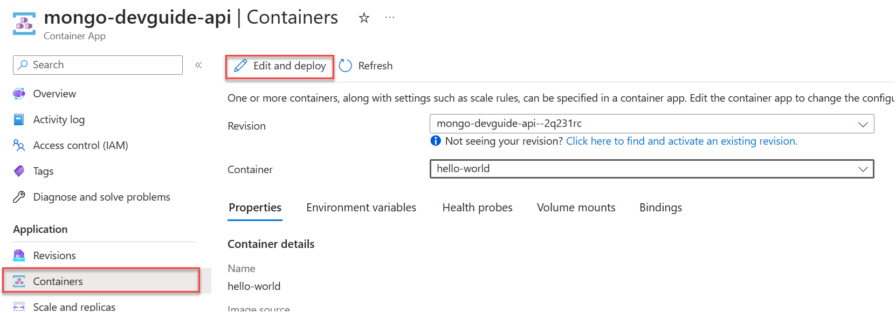
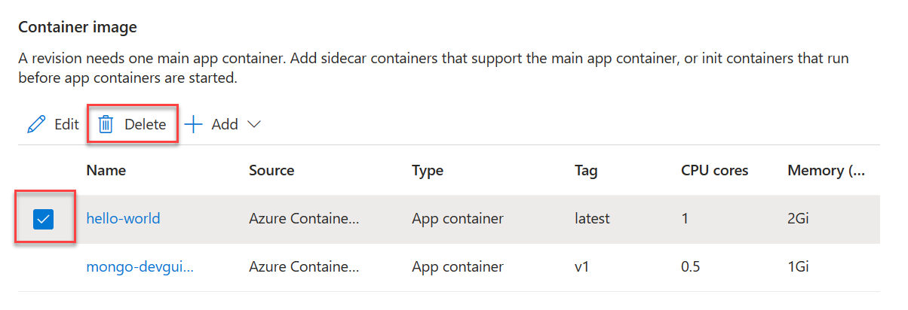
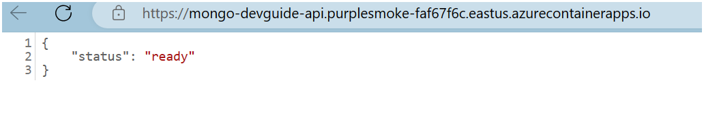

# Backend API

In the previous lab, a LangChain agent was created armed with tools to do vector lookups and concrete document id lookups via function calling. In this lab, the agent functionality needs to be extracted into a backend api for the frontend application that will allow users to interact with the agent.

The information provided in this section assumes that the dependent infrastructure is deployed and have completed the previous labs in this dev guide.

## Overview

The backend api is a Python FastAPI application that will expose endpoints for the frontend application to interact with. The backend api is a containerized application that will be deployed to [Azure Container Apps](https://learn.microsoft.com/en-us/azure/container-apps/overview).

## Clone the Backend API

Create a folder to house the repository. Open a terminal and navigate to the folder. Clone the repository, then navigate to the `Backend` folder within the repository.

```bash
git clone https://github.com/AzureCosmosDB/Azure-OpenAI-Python-Developer-Guide.git

cd Azure-OpenAI-Python-Developer-Guide
cd Backend
```

## Run the backend api locally

When developing a backend api, it is often useful to run the application locally to test and debug. This section outlines how to run the backend api locally while watching the file system for code changes. Any detected changes will automatically restart the backend api.

1. Open the backend api folder location in VS Code.

2. Open a **Terminal** window in VS Code (<kbd>CTRL</kbd>+<kbd>`</kbd>).

3. Setup the `.env` file. Copy the `.env.example` file to `.env` and update the values. These are the same environment variables used in the previous labs.

    ```bash
    cp .env.example .env
    ```

4. Using the Terminal window, [create a virtual environment and activate it](https://python.land/virtual-environments/virtualenv).

5. Run the following command to install the dependencies.

    ```bash
    pip install -r requirements.txt
    ```

6. Run the following command to start the backend api in the virtual environment.

    ```bash
    uvicorn --host "0.0.0.0" --port 8000 app:app --reload
    ```

    

7. Open a browser and navigate to `http://localhost:8000/docs` to view the Swagger UI.

    

8. Expand the **GET / Root** endpoint and select **Try it out**. Select **Execute** to send the request. The response should display a status of `ready`.

    

9. Expand the **POST /ai** endpoint and select **Try it out**. In the **Request body** field, enter the following JSON.

    ```json
    {
        "session_id": "abc123",
        "prompt": "What was the price of the product with sku `FR-R92B-58`"
    }
    ```

10. Select **Execute** to send the request. Observe that the response indicates the price as being `$1431.50`.

    

11. In the Terminal window, press <kbd>CTRL</kbd>+<kbd>C</kbd> to stop the backend api.

## Build and run the backend api container locally in Docker Desktop

When deployed to Azure, the backend api will be running in a container. It is important to test the container locally to ensure it is working as expected. Containers are important because they provide a consistent environment for the application to run in. This consistency allows the application to run the same way in development, test, and production environments - whether they be locally or in the cloud.

The backend api contains a `Dockerfile` that defines the container image and is used by Docker to build the container image. The Dockerfile contains instructions for Docker to build the container image. The container image is a snapshot of the application and its dependencies. The container image can be thought of an installer for the application to be deployed as needed in any environment.

The `Dockerfile` for the backend api is shown below.

```dockerfile
FROM python:3.11

WORKDIR /code
COPY ./requirements.txt /code/requirements.txt
RUN pip install --no-cache-dir --upgrade -r /code/requirements.txt
COPY . /code

EXPOSE 80
ENV FORWARDED_ALLOW_IPS *

CMD ["uvicorn", "app:app", "--host", "0.0.0.0", "--port", "80", "--forwarded-allow-ips", "*", "--proxy-headers"]
```

Notice the steps of installing the pip dependencies, and running the **uvicorn** command line similar to what was done in the previous section.

1. Ensure Docker Desktop is running.

2. Open a **Terminal** window in VS Code (<kbd>CTRL</kbd>+<kbd>`</kbd>).

3. If the terminal displays the virtual environment name, deactivate the virtual environment by running the following command.

    ```bash
    deactivate
    ```

4. Run the following command to build the container image. Once complete, a message displays the operation has `FINISHED`.

    ```bash
    docker build --pull --rm -f "DOCKERFILE" -t devguidebackendapi:latest "."
    ```

    

5. Lastly, run the container in Docker Desktop using the following command.

    ```bash
    docker run -d -p 4242:80 --name devguide-backend-api devguidebackendapi:latest
    ```

    

6. Open a browser and navigate to `http://localhost:4242/docs` to view the Swagger UI.

7. Repeat steps 8-10 from the previous section to test the backend api running in a container on Docker Desktop.

## Deploy the backend api to Azure Container Apps

### Retrieve the Azure Container Registry login server and admin credentials

The backend api container image needs to be pushed to an Azure Container Registry (ACR) before it can be deployed to Azure Container Apps. The ACR is a private container registry that will store the container image. Azure Container Apps will pull the container image from the ACR to deploy the backend api.

1. In the Azure portal, open the provisioned resource group and locate and open the **Container Registry** resource.

2. Select **Access keys** from the left-hand menu. Record the **Login server** value and the **Username** and **Password** values for later use.

    

### Push the backend api container image to the Azure Container Registry

Earlier, the backend api container image was built locally. Now that the ACR login server and admin credentials are known, the container image can be pushed to the Azure Container Registry.

1. Return to the terminal window in VS Code.

2. Run the following command to tag the container image with the ACR login server. Replace the `<login server>` value. This command will silently complete with no output.

    ```bash
    docker tag devguidebackendapi:latest <login server>/devguidebackendapi:v1
    ```

3. Run the following command to log into the ACR. Replace the `<login server>`, `<username>`, and `<password>` values. The message `Login Succeeded` displays when the login is successful.

    ```bash
    docker login <login server> -u <username> -p <password>
    ```

4. Once authenticated, push the container image to the ACR using the following command. Replace the `<login server>` value.

    ```bash
    docker push <login server>/devguidebackendapi:v1
    ```

    

### Deploy the backend api ACR container image to Azure Container Apps

The last step is to deploy the backend api container image to Azure Container Apps. Azure Container Apps is a fully managed serverless container platform that allows developers to deploy containerized applications without having to manage any infrastructure.

1. In the Azure portal, open the provisioned resource group and locate and open the **Container App** resource, the name will end in `-api`. Record the name of this resource.

2. Back in the resource group, locate the **Container Apps Environment** resource, the name will end in `-containerappenv`. Record the name of this resource.

3. Also record the name of the resource group.

4. Return to the terminal window in VS Code.

5. Log into the Azure CLI using the following command.

    ```bash
    az login
    ```

6. Optionally set the current subscription to the correct subscription using the following command.

    ```bash
    az account set --subscription <subscription id>
    ```

7. Install the Azure Container Apps extension for the CLI using the following command.

    ```bash
    az extension add --name containerapp --upgrade
    ```

8. Run the following command to deploy the backend api container image to the existing Azure Container Apps resource. Replace the `<container app name>`, `<login server>`, `<resource group name>`, and `<container app environment name>` values.

    ```bash
    az containerapp up --name <container app name> --image <login server>/devguidebackendapi:v1 --resource-group <resource group name> --environment <container app environment name> --ingress external
    ```

    

9. In the Azure Portal, locate and open the **Container App** resource ending in `-api`.

10. Notice on the **Overview** screen, there is a failed container revision. This is because the `hello-world` container is running at the same binding address as the backend api container.

    

11. View the error from the logs, or optionally select **Log stream** from the left menu, then select the api container log stream.

    

12. To rectify this, the `hello-world` container needs to be deleted. Select **Containers** from the left menu, then choose the **Edit and Deploy** button from the toolbar.

    

13. On the **Create and deploy new revision** screen, beneath the **Container image** heading, check the box next to the `hello-world` container, then select **Delete**.

    

14. Select **Create** to deploy the new revision. In less than a minute, the new revision is deployed.

15. Refresh the browser, then from the left menu, select **Overview**. Select the **Application URL** link.

    

16. The UI should show the status as `ready`.

    

17. In the address bar of the browser, append `/docs` to the URL and press <kbd>ENTER</kbd> to view the Swagger UI.

18. Repeat steps 8-10 from the [Run the backend api locally section](#run-the-backend-api-locally) to test the backend api running in a container on Azure Container Apps.

Congratulations on the successful deployment of the backend api to Azure Container Apps where it is ready to service the frontend application.
