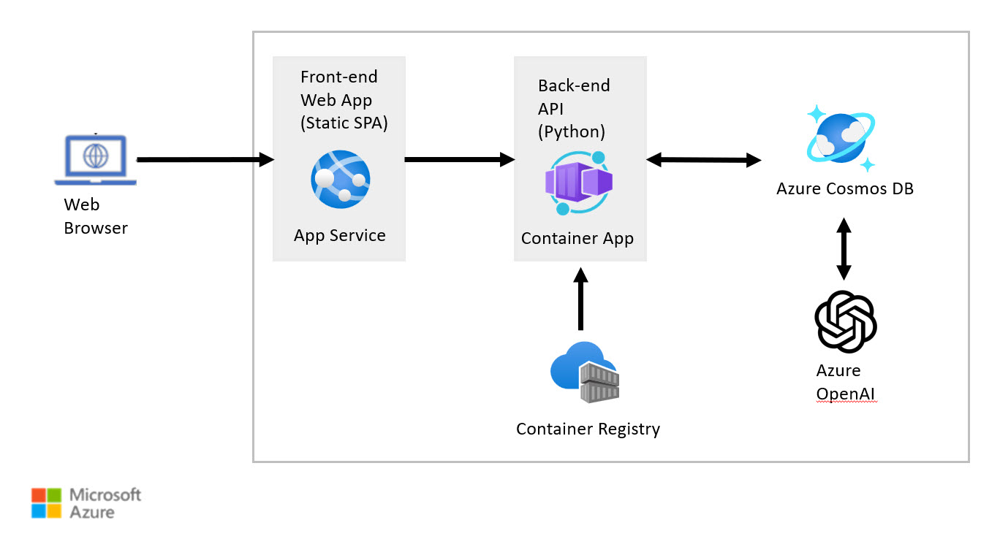

# Azure Cosmos DB for MongoDB (vCore) + Azure OpenAI Python Developer Guide

1. [Introduction](00_Introduction/README.md)
1. [Azure Overview](01_Azure_Overview/README.md)
1. [Overview of Azure Cosmos DB](02_Overview_Cosmos_DB/README.md)
1. [Overview of Azure OpenAI](03_Overview_Azure_OpenAI/README.md)
1. [Overview of AI Concepts](04_Overview_AI_Concepts/README.md)
1. [Explore the Azure OpenAI models and endpoints (console app)](05_Explore_OpenAI_models/README.md)
1. [Provision Azure resources](06_Provision_Azure_Resources/README.md)
1. [Create your first Cosmos DB project](07_Create_First_Cosmos_DB_Project/README.md)
1. [Load data into Azure Cosmos DB API for MongoDB](08_Load_Data/README.md)
1. [Use vector search on embeddings in vCore-based Azure Cosmos DB for MongoDB](09_Vector_Search_Cosmos_DB/README.md)
1. [LangChain](10_LangChain/README.md)
1. [Backend API](11_Backend_API/README.md)
1. [Connect the chat user interface with the chatbot API](12_User_Interface/README.md)
1. [Conclusion](13_Conclusion/README.md)

